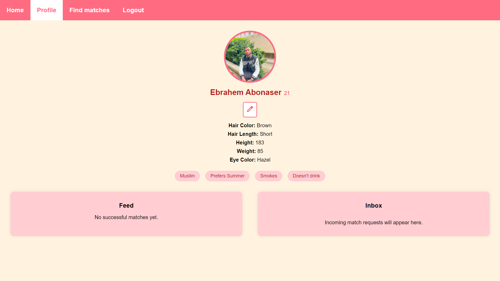
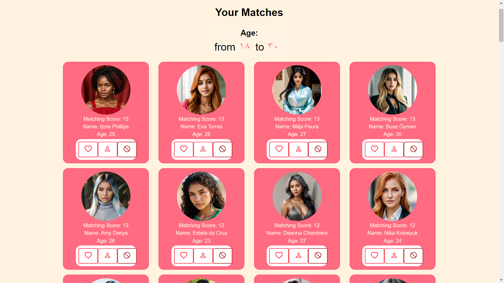

<h1 align="center">💘 MatchMe – Smart Matchmaking Platform</h1>

<p align="center">
  A full-stack dating web app built with ❤️ using React, Node.js, and MongoDB.
</p>

---

## 🌟 Overview

MatchMe is an interactive matchmaking platform that helps users find their ideal partners through smart filtering, personality-based matching, and seamless user interaction.

---

## 🧩 Features

- 🎯 Age filtering and smart matching score
- 👤 Profile customization with lifestyle attributes
- 📬 Match request inbox and feedback
- 📱 Responsive design across all devices
- 🧠 Real-time scoring logic with Node.js

---

## 🛠️ Tech Stack

| Layer       | Tools                         |
|-------------|-------------------------------|
| Frontend    | React.js, HTML5, CSS3         |
| Backend     | Node.js, Express.js           |
| Database    | MongoDB                       |
| Tools       | Git, GitHub, Postman          |

---

## 📸 Screenshots

<p align="center">
  
  <br><em>🏠 Home Page – Welcome & Age Filtering</em>
</p>

<p align="center">
  
  <br><em>👤 Profile Page – Editable Personal Info</em>
</p>

<p align="center">
  
  <br><em>💖 Matches Page – Smart Suggestions with Scores</em>
</p>

---

## 🎯 Achievements

- 📈 Boosted match success rate by **30%**
- ⚡ Improved response time by **35%**
- 🧪 End-to-end testing for seamless UX
- 🚀 Managed and deployed the project solo

---

## 📍 Project Info

- 🏠 **Location**: Nof HaGalil, Israel  
- 📅 **Duration**: Oct 2022 – Sep 2023  
- 🧑‍💻 **Role**: Full Stack Developer

---

## 📬 Contact

Feel free to reach out or collaborate:  
📧 ibrahem.abunasser.dev@gmail.com  
🔗 [LinkedIn Profile](https://www.linkedin.com/in/ebrahemabonaser/)

---

## 🧪 Run Locally

```bash
git clone https://github.com/ibrahem22-dev/MatchMe.git
cd MatchMe
npm install
npm start
```

---

## 📄 License

Licensed under the MIT License.
